# Ferramentas Utilizadas

- **Kali Linux** (Sistema Operacional)
- **setoolkit** (Aplicação)

## Configurando Phishing com o Kali Linux

Acesso do usuário: login como root

Iniciando a aplicação Setoolkit: em terminal digitar o comando "setoolkit"

Tipo de ataque: escolher a opção (1) "social-engineering attacks"

Vetor do ataque: escolher a opção (2) "website attack vectors"

Método de ataque: escolher a opção (3) "credential harvester attack method"

Método de ataque - template: (2) "site cloner"

Identificando o IP da máquina que irá exibir o site falso (servidor): "10.2.X.X"

Definir a URL a ser clonada: "http://www.facebook.com"

## INFORMAÇÕES ADICIONAIS

A sequência de imagens mostra os passos que foram executados para configurar o ataque e o resultado da captura do usuário e senha informado pelo utilizador do site.

Os prints que contém o endereço IP do servidor estão com parte apagada para mascarar e não ser identificado.

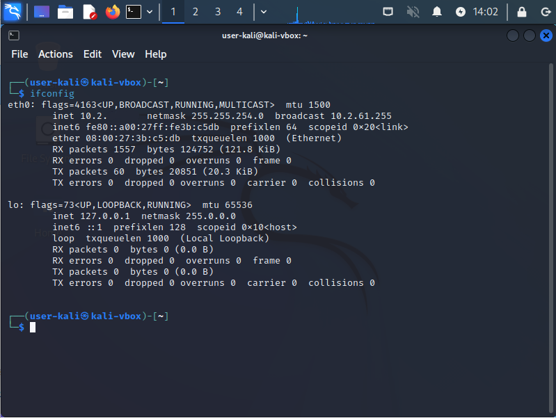
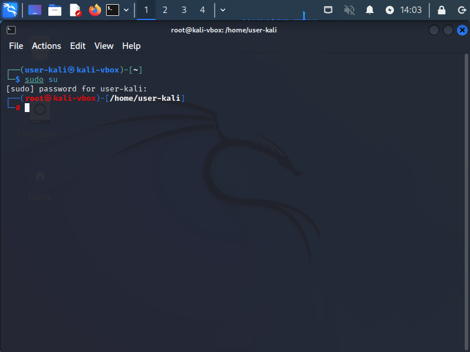
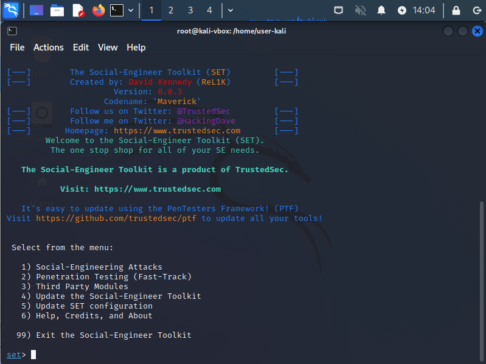
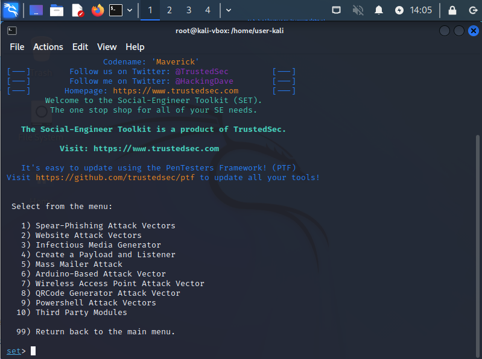
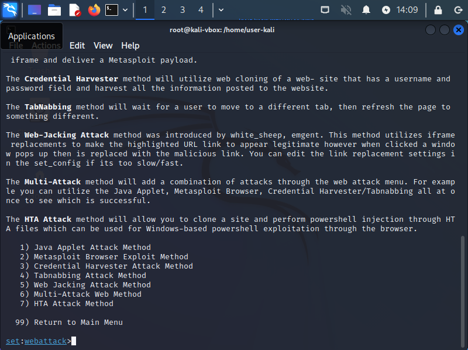
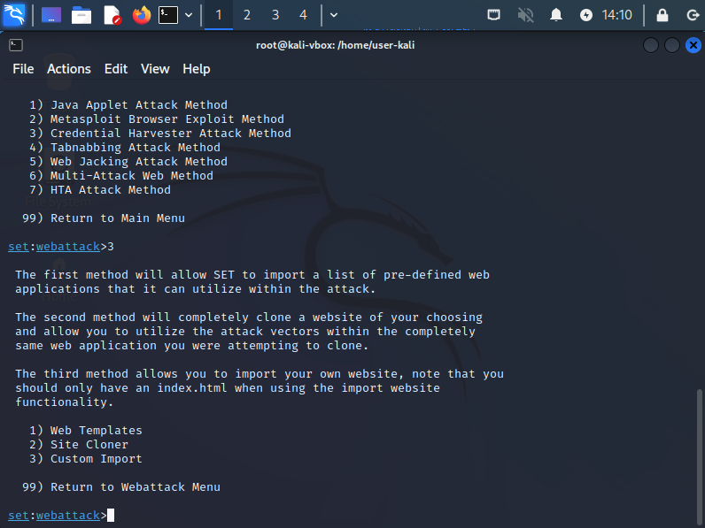
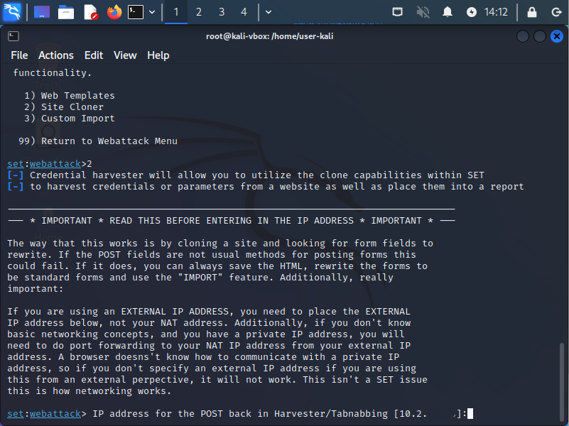
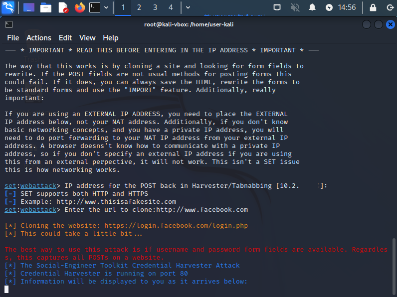
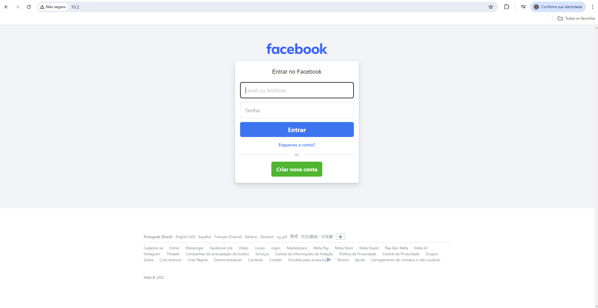
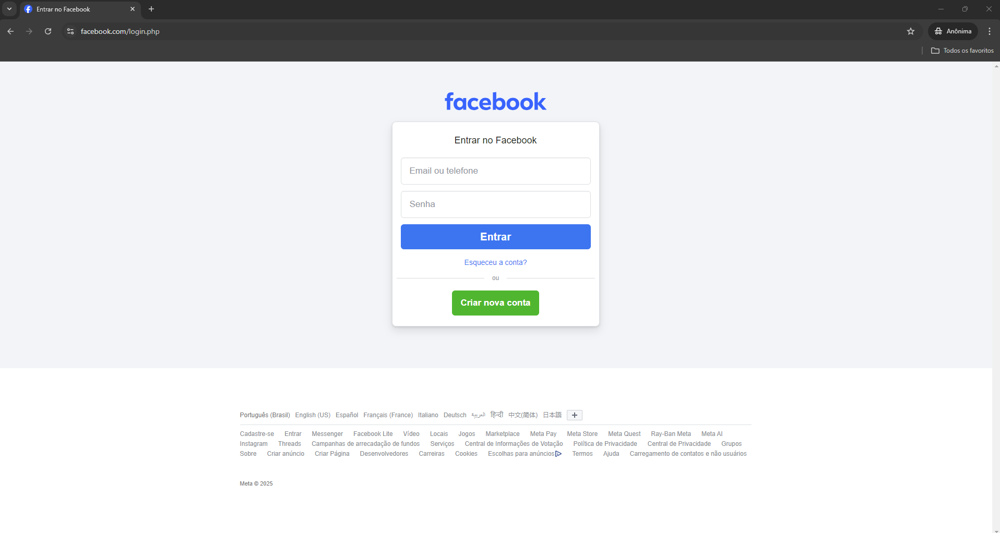
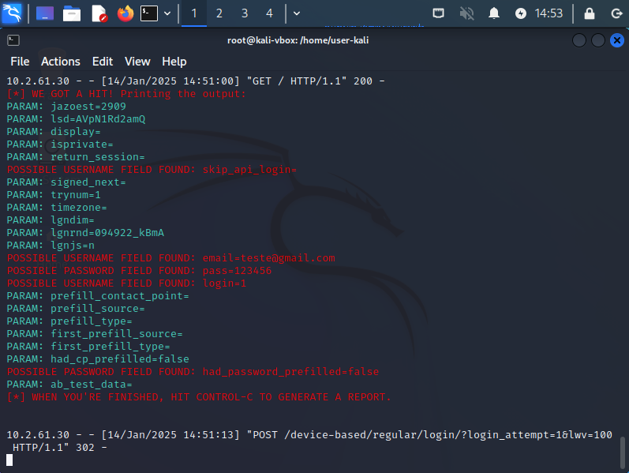
